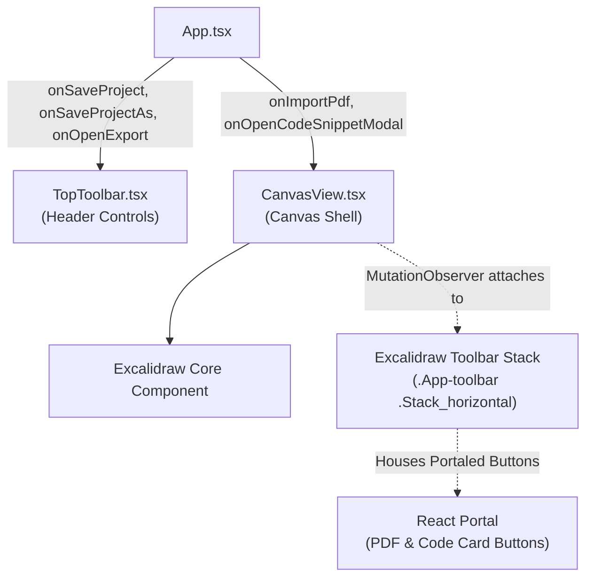

# Canvas Toolbar Docking & UI Ergonomics Specification

> **Status**: Implemented  
> **Target Subsystems**: [`CanvasView.tsx`](../src/renderer/src/components/canvas/CanvasView.tsx), [`TopToolbar.tsx`](../src/renderer/src/components/toolbar/TopToolbar.tsx), [`App.tsx`](../src/renderer/src/App.tsx), [`app.css`](../src/renderer/src/styles/app.css)

---

## 1. Overview & Motivation

In previous iterations, primary insertion actions for technical media (PDF / Presentation Slides and Syntax-Highlighted Code Cards) were mounted in the top application header. This separated them from Excalidraw's primary creation tools (shapes, text, arrows, pens) located in the floating canvas dock.

Additionally:
- The top toolbar had separate standalone buttons for "Save", "Save As...", "Bookmark View", and "Tour", cluttering the center actions group.
- Redundant UI controls from Excalidraw's default layer (such as the right-edge floating library trigger and built-in image picker) conflicted with CanvasTube's dedicated Architecture Library and asset pipeline.
- The global hotkey `Ctrl+E` intercepted canvas interactions, colliding with Excalidraw's native eraser hotkey (`E`).

This refactor consolidates and declutters the interface by docking CanvasTube insertion actions directly into Excalidraw's native toolbar stack, unifying file and tour controls into split and segmented components, and suppressing redundant engine chrome.

---

## 2. Architecture & Data Flow



---

## 3. Subsystem Implementation Details

### 3.1 Excalidraw Canvas Toolbar Docking ([`CanvasView.tsx`](../src/renderer/src/components/canvas/CanvasView.tsx))

Rather than maintaining a separate floating toolbar layer that could collide with Excalidraw's responsive layout, CanvasTube injects custom action buttons directly into Excalidraw's horizontal toolbar stack via React Portal:

1. **Toolbar Discovery via `MutationObserver`**:
   - Because Excalidraw renders its internal UI dynamically, a `MutationObserver` watches `containerRef.current`.
   - When `.App-toolbar .Stack_horizontal` (or fallback `.App-toolbar`) mounts, its DOM node is stored in the `toolbarEl` React state.
   - The observer automatically disconnects on component unmount.

2. **Portaled Action Elements**:
   Using `createPortal(<... />, toolbarEl)`, CanvasTube appends:
   - `<div className="App-toolbar__divider" />`: Matches Excalidraw's native vertical section dividers.
   - **PDF / Presentation Slides Trigger**:
     - Icon: `FileText` (`#ef4444`, 17px)
     - Action: Triggers `onImportPdf()`
     - Title: `"Import PDF / Presentation Slides onto Canvas"`
   - **Code Card Trigger**:
     - Icon: `Terminal` (`#10b981`, 17px)
     - Action: Triggers `onOpenCodeSnippetModal()`
     - Title: `"Insert Syntax-Highlighted Code Card"`

3. **Disabling Default Image Picker**:
   - Excalidraw's default `tools.image` is set to `false` in `UIOptions`.
   - All image additions are managed through CanvasTube's content-addressed asset store and SHA-256 deduplication pipeline.

---

### 3.2 Top Toolbar Consolidation ([`TopToolbar.tsx`](../src/renderer/src/components/toolbar/TopToolbar.tsx))

The main header bar was reorganized to maximize horizontal space and group complementary workflows:

1. **Unified Save & Save As Split-Button**:
   - Merged two discrete buttons into a cohesive split-button component.
   - **Primary Button**: Direct save (`Ctrl+S`) with `Save` icon.
   - **Chevron Button**: Displays a dropdown menu containing:
     - `Save` (`Ctrl+S`)
     - `Save As...` (`Ctrl+Shift+S`)
   - **Click-Outside Detection**: A `mousedown` event listener dismisses the dropdown when clicks occur outside `saveMenuRef`.

2. **Unified Tour & Quick-Bookmark Segmented Control**:
   - Replaced the separate "Bookmark View" and "Tour" buttons with a single segmented pill control.
   - **Tour Drawer Toggle**: Opens the slide-out Bookmarks Drawer and displays the active bookmark count badge.
   - **Vertical Hairline Divider**: Clear visual separation between the drawer toggle and action trigger.
   - **Quick-Add (`+`) Trigger**: Captures the current camera position into the tour immediately via `onAddBookmark` without requiring the drawer to be open.

3. **Action Pruning**:
   - Removed "PDF / Slides" and "Code Card" buttons from the center group since they now live in the canvas dock.

---

### 3.3 CSS Isolation & Native Engine Suppression ([`app.css`](../src/renderer/src/styles/app.css))

1. **Right-Edge Library Trigger Suppression**:
   ```css
   .excalidraw .sidebar-trigger.default-sidebar-trigger,
   .excalidraw .default-sidebar-trigger,
   .excalidraw .layer-ui__wrapper .sidebar-triggers {
     display: none !important;
   }
   ```
   Prevents Excalidraw from displaying its default library trigger on the right edge, unifying all architecture stencils under CanvasTube's left-side Architecture Library drawer.

2. **Dock Button Styling (`.canvastube-dock-btn`)**:
   - Replicates Excalidraw's design tokens:
     - Size: `var(--lg-button-size, 36px)` × `var(--lg-button-size, 36px)`
     - Radius: `var(--border-radius-lg, 8px)`
     - Hover background: `var(--button-hover-bg, rgba(255, 255, 255, 0.1))`
     - Active tactile scaling: `transform: scale(0.92)`

---

### 3.4 Hotkey Collision Resolution ([`App.tsx`](../src/renderer/src/App.tsx))

- Removed the `Ctrl+E` / `Cmd+E` hotkey listener for opening the export dialog.
- In drawing applications, single-key shortcuts (`E` for Eraser) are critical for digitizer stylus ergonomics. Intercepting `Ctrl+E` introduced modifier-release race conditions on Wayland and Windows.
- Export remains prominently accessible via the top toolbar button.

---

## 4. Verification & QA Matrix

| Area | Test Case | Expected Result | Pass |
|---|---|---|---|
| **Dock Injection** | Launch application | PDF & Terminal icons appear seamlessly inside Excalidraw's horizontal dock | Yes |
| **Dock Actions** | Click PDF icon | Opens native OS file picker for `.pdf` documents | Yes |
| **Dock Actions** | Click Terminal icon | Opens Code Card syntax highlighting modal | Yes |
| **Save Split-Button** | Click primary Save | Saves current project / triggers Save As if untitled | Yes |
| **Save Dropdown** | Click chevron | Opens dropdown with Save and Save As options | Yes |
| **Save Dismissal** | Click outside dropdown | Automatically closes dropdown without triggering canvas strokes | Yes |
| **Tour Pill** | Click "Tour" | Toggles Bookmarks Drawer; shows badge count | Yes |
| **Tour Quick-Add** | Click `+` button | Saves current camera zoom/coordinates to bookmarks | Yes |
| **Clean Recording** | Press `F10` | Collapses toolbars; floating minimal HUD displays properly | Yes |
| **Compilation** | `npm run typecheck` | 0 TypeScript errors across node & web targets | Yes |
