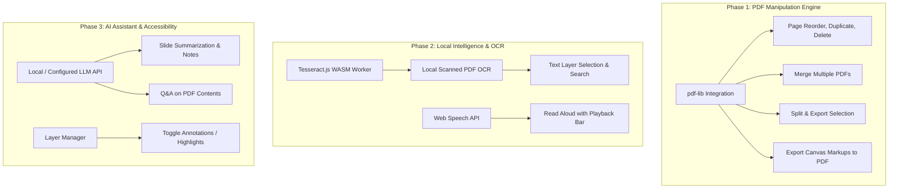

# Canvas-Tube PDF Browser-Parity & Feature Gap Analysis Report

> **Target System:** Canvas-Tube (Offline Desktop Infinite-Canvas Workspace for Technical Explanations & Recording)  
> **Evaluation Reference:** Desktop Browser Native PDF Engines (Firefox, Google Chrome, Microsoft Edge, and baseline Chromium/Safari)  
> **Date:** September 2026

---

## Executive Summary

Standard modern browsers (Firefox, Chrome, Edge) have evolved beyond simple document readers into three distinct specializations:
1. **Firefox:** Document manipulation & page-level editing (merge, split, reorder, delete, images, reusable signatures).
2. **Chrome:** Scanned document intelligence (local on-device OCR, text selection on raster scans) & ecosystem storage.
3. **Edge:** Reading accessibility, AI assistance (Read Aloud, multi-language translation, Copilot summarization/Q&A) & enterprise DRM/digital signatures.

**Canvas-Tube** occupies a unique position: it is not a constrained linear single-page reader, but an **infinite-canvas workspace** designed for visual communication, technical explanation, and recording. While Canvas-Tube already surpasses conventional browsers in multi-page visual layout, freeform inking, arbitrary annotations, and video presentation, it currently relies on `pdfjs-dist` primarily for page rendering to images.

To achieve complete coverage of the browser PDF capabilities without compromising Canvas-Tube's offline, privacy-first desktop philosophy, this report details:
- A full feature parity matrix across all 33+ browser capabilities.
- Identification of existing native coverage, easily addressable gaps, and vendor-specific edge cases.
- An actionable, production-ready technical architecture roadmap.

---

## Complete Browser PDF Feature Parity Matrix

| # | Feature | Reference Browser | Canvas-Tube Current Status | Parity Strategy & Technical Recommendation | Priority |
|---|---------|-------------------|----------------------------|--------------------------------------------|----------|
| **1** | **Merge multiple PDFs** | Firefox | ⚠️ Partial (can import multiple PDFs into dock) | Integrate `pdf-lib` in main/renderer process to concatenate arbitrary PDF binary streams into a single exportable document. | **P1 (High)** |
| **2** | **Drag-and-drop page reordering** | Firefox | ⚠️ Dock supports canvas drop, not PDF re-indexing | Add thumbnail reorder drag-and-drop in `DocumentSlideDock` to re-sequence pages before saving or canvas layout. | **P1 (High)** |
| **3** | **Cut + paste PDF pages** | Firefox | ⚠️ Canvas clipboard only | Page-level clipboard in `DocumentSlideDock` to cut/copy/paste pages between document slots. | **P2 (Medium)** |
| **4** | **Copy / duplicate PDF pages** | Firefox | ⚠️ Canvas duplication only | Add "Duplicate Page" button on dock thumbnail to replicate page in the underlying PDF page tree. | **P1 (High)** |
| **5** | **Delete PDF pages** | Firefox | ❌ Missing | Add "Delete Page" context action in `DocumentSlideDock`, mutating the active document index via `pdf-lib`. | **P1 (High)** |
| **6** | **Split PDF / export selected pages** | Firefox | ❌ Missing | Multi-select thumbnails in dock & export selection directly to a new `.pdf` file. | **P1 (High)** |
| **7** | **Insert arbitrary images into PDF** | Firefox | ✅ **Supported & Superior** | Full image insertion, resizing, repositioning, and locking on top of PDF slides via Excalidraw canvas. | **Existing** |
| **8** | **Add alt text to PDF images** | Firefox | ⚠️ Partial (customData metadata) | Expose an accessibility / alt-text field on canvas image objects and preserve it during PDF export. | **P3 (Low)** |
| **9** | **Local AI-generated alt text** | Firefox | ❌ Missing | Optional local multimodal model (e.g. MobileVLM / Transformers.js or local Ollama) to generate slide/image captions. | **P3 (Future)** |
| **10** | **Saved reusable signatures** | Firefox | ⚠️ Canvas library / stencils | Add a dedicated "Signature Stamp" tool or library preset in Excalidraw for one-click reuse. | **P2 (Medium)** |
| **11** | **Type a signature** | Firefox | ⚠️ Canvas text tool | Script font generator dialog (`Caveat`, `Dancing Script`) saving vector signature stamp to library. | **P2 (Medium)** |
| **12** | **Signature from image** | Firefox | ✅ Supported | Image asset importer with transparent background filter. | **Existing** |
| **13** | **Signature alt text** | Firefox | ⚠️ Custom metadata | Automatically attach "Signature of [Name]" metadata on signature objects. | **P3 (Low)** |
| **14** | **Comment-management sidebar** | Firefox | ⚠️ Bookmark system exists | Extend existing Bookmark/Scene drawer into an interactive comment & annotation index linked to slides. | **P2 (Medium)** |
| **15** | **Toggle visibility of all highlights** | Firefox | ⚠️ Canvas layer toggle | Add a quick toggle in the viewport / presenter bar to hide/show ink and highlight strokes (`opacity: 0`). | **P1 (High)** |
| **16** | **Automatic OCR of scanned PDFs** | Chrome | ❌ Missing | Integrate `tesseract.js` (WebAssembly worker) to extract text layers from raster PDF pages. | **P1 (High)** |
| **17** | **OCR runs locally on-device** | Chrome | 🌟 **Core Philosophy** | `tesseract.js` runs 100% offline in WebAssembly worker—zero cloud calls, total privacy. | **P1 (High)** |
| **18** | **Copy text from scanned PDFs** | Chrome | ❌ Missing for raster slides | OCR overlays a transparent text layer (`textLayer` in PDF.js or selectable DOM layer over canvas slide). | **P1 (High)** |
| **19** | **Save directly to Google Drive** | Chrome | ❌ Out of scope (Local First) | Provide standardized OS export dialogs + Electron drag-out or optional cloud sync plugin. | **P3 (Low)** |
| **20** | **Download with/without changes** | Chrome | ⚠️ Can export scene or raw PDF | Provide two explicit export targets: "Export Original PDF" vs. "Export Annotated PDF with Canvas Markups". | **P1 (High)** |
| **21** | **Fill PDFs without form fields** | Chrome | ✅ **Supported & Superior** | Any slide on the infinite canvas can receive arbitrary floating, resizable text, checkboxes, and notes. | **Existing** |
| **22** | **PDF Read Aloud** | Edge | ❌ Missing | Use native browser `window.speechSynthesis` (Web Speech API) to read PDF text streams with playback/rate controls. | **P1 (High)** |
| **23** | **Selected-text translation** | Edge | ❌ Missing | Integrated translation modal/popover using offline models (Bergamot / Transformers.js) or user API keys. | **P2 (Medium)** |
| **24** | **Translation side pane** | Edge | ❌ Missing | Translation tab in the collapsible sidebar displaying source vs. translated text side-by-side. | **P2 (Medium)** |
| **25** | **70+ translation languages** | Edge | ❌ Missing | Supported through standard translation engines (offline MarianMT/NLLB-200 via ONNX or cloud translation fallback). | **P2 (Medium)** |
| **26** | **Read translated text aloud** | Edge | ❌ Missing | Pipe translated string directly to `speechSynthesis.speak(utterance)` with target locale voice. | **P2 (Medium)** |
| **27** | **Copilot PDF summarization** | Edge | ❌ Missing | Add an offline/local LLM or user-configured AI assistant for slide summarization and slide outline generation. | **P2 (Medium)** |
| **28** | **Ask follow-up questions (Chat PDF)** | Edge | ❌ Missing | RAG / Vector search over extracted PDF page text embeddings + conversational panel. | **P2 (Medium)** |
| **29** | **Certificate digital signature validation** | Edge | ❌ Missing | Cryptographic validation of PKCS#7 / CMS signatures via Node `node-forge` or `pdf-lib` in main process. | **P3 (Low/Specialized)** |
| **30** | **Secure-mode signature validation** | Edge | ❌ Missing | Sandboxed Electron utility process for signature certificate verification against system trust store. | **P3 (Low/Specialized)** |
| **31** | **Microsoft Purview-protected PDFs** | Edge | 🔒 Vendor Locked (Microsoft Cloud DRM) | Requires proprietary Microsoft SDK and active Azure AD / M365 tenant auth. Recommended as out-of-scope for offline tool. | **Out of Scope** |
| **32** | **IRM-protected PDF support** | Edge | 🔒 Vendor Locked (Enterprise DRM) | Proprietary Microsoft Rights Management encryption. Notify user gracefully if encrypted PDF is encountered. | **Out of Scope** |
| **33** | **Cross-tenant protected PDFs** | Edge | 🔒 Vendor Locked | Requires Microsoft Cloud enterprise identity broker. Gracefully display decryption error. | **Out of Scope** |

---

## Baseline Features Analysis (Table Stakes)

All mainstream desktop browsers provide baseline reading conveniences. Canvas-Tube compares as follows:

| Baseline Feature | Standard Browser | Canvas-Tube Capabilities | Canvas-Tube Advantage |
|---|---|---|---|
| **Viewing Local PDFs** | Tabbed / Single-page scrolling | Infinite Canvas + Slide Dock | Multi-slide spatial layout, juxtaposition, visual timelines |
| **Zoom & Navigation** | Step zoom, fit-to-width/page | Smooth infinite pan/zoom (10% - 500%), Minimap | Smooth zoom across multiple slides simultaneously |
| **Rotate Pages** | Document-level 90° increments | Individual object rotation on canvas (any angle: 0°-360°) | Arbitrary free rotation and slant |
| **Freehand Inking & Highlights** | Basic pen & yellow highlighter | Excalidraw pens, highlighters, arrows, shapes, color palettes | Pressure-sensitive smoothing, roughness styles, eraser, grouping |
| **Arbitrary Added Text** | Basic text boxes | Markdown, rich text, code blocks with syntax highlighting | Technical explanation tooling (Prism syntax highlighter, math) |
| **Form Filling** | Interactive AcroForms | Visual text placement anywhere over forms | Works on both scanned flat forms and fillable PDFs |
| **Presentation / Recording** | Not available (external tool needed) | Built-in webcam overlay, audio capture, canvas video recorder | Instant creation of recorded lectures/walkthroughs directly |

---

## Strategic System Enhancement Roadmap

### 1. Document Manipulation Architecture (`pdf-lib`)
- **Action:** Add `pdf-lib` to dependencies.
- **Benefits:** Fast, client-side, zero-native-dependency PDF modification.
- **Capabilities unlocked:**
  - Merge another PDF directly into the active document.
  - Reorder, duplicate, delete pages directly inside `DocumentSlideDock`.
  - Export selected slides as a standalone clean PDF or an annotated PDF containing canvas annotations.

### 2. Privacy-First Local OCR (`tesseract.js`)
- **Action:** Spawn a Web Worker running `tesseract.js` using bundled English/multi-language traineddata.
- **Benefits:** Completely offline, on-device OCR for image-only scans.
- **Capabilities unlocked:**
  - Scanned documents automatically produce searchable and selectable text.
  - User can copy code or text from image slides dropped onto the canvas.

### 3. Voice Read-Aloud & Translation (Web Speech API)
- **Action:** Utilize native browser `window.speechSynthesis` and `SpeechSynthesisUtterance`.
- **Benefits:** No external dependencies, zero latency, supports all OS installed voices.
- **Capabilities unlocked:**
  - Highlight slide text or press "Read Aloud" in the slide dock to listen to slides.
  - Add text translation via open translation APIs or offline ONNX models.

### 4. Enterprise DRM Scope Clarification
- **Microsoft Purview / IRM Protection:** These formats use proprietary Azure Information Protection (AIP) encryption tied to Microsoft 365 cloud credentials. Browser engines like Chromium cannot open them without Microsoft's proprietary binary plugins.
- **Decision:** As an offline, open, privacy-oriented desktop application, Canvas-Tube should detect encrypted/DRM-locked files and gracefully inform the user with a descriptive dialog rather than bundling heavy proprietary enterprise dependencies.

---

## Conclusion & Recommendations

Canvas-Tube already eclipses traditional browser viewers for **authoring, technical explanations, inking, and video recording**. By adopting:
1. **`pdf-lib`** for page-level document manipulation (Firefox parity).
2. **`tesseract.js`** for local, privacy-first OCR (Chrome parity).
3. **`speechSynthesis`** and an AI assistant drawer for Read Aloud and slide intelligence (Edge parity).
4. An **"Export Annotated PDF"** pipeline merging Excalidraw vector layers onto original PDF pages.

Canvas-Tube will encompass the full spectrum of modern browser capabilities while remaining the undisputed premier infinite-canvas document workspace.
